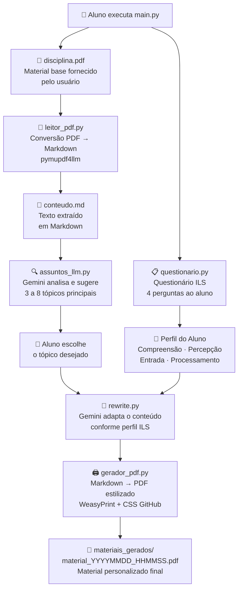

# 🎓 Sistema de Personalização de Materiais Didáticos — Explicação Didática

> Projeto desenvolvido no **Mestrado em Ciência da Computação — UFMA**  
> Baseado no modelo de estilos de aprendizagem de **Felder-Silverman (ILS)** integrado à **API Gemini (Google AI)**

---

## 💡 O que é este projeto?

A ideia central é simples e poderosa:

> **Você fornece o PDF de uma disciplina. O sistema lê o seu perfil de aprendizagem e gera automaticamente um novo PDF com o conteúdo adaptado especificamente para o seu jeito de aprender.**

A base teórica é o modelo **Felder-Silverman (ILS)** — um método científico amplamente usado na educação para classificar estilos de aprendizagem em 4 dimensões. A IA usada é o **Google Gemini**.

---

## 🗺️ Fluxo Completo (passo a passo)



---

## 📁 Responsabilidade de cada arquivo

### `main.py` — O Maestro 🎼

É o **orquestrador**: não faz nada por conta própria, mas chama todos os módulos na ordem certa. Ele:

1. Verifica se `disciplina.pdf` existe
2. Roda o questionário (perfil do aluno)
3. Converte o PDF para Markdown
4. Identifica e localiza o tópico escolhido
5. Adapta o conteúdo via Gemini
6. Gera o PDF final personalizado

> **Detalhe técnico:** No macOS, o `main.py` recarrega o próprio processo ao iniciar para garantir que a biblioteca `libpango` (exigida pelo WeasyPrint) seja encontrada corretamente pelo sistema.

---

### `modulos/aluno/questionario.py` — O Perfil do Aluno 🧠

Aplica **4 perguntas** baseadas no Index of Learning Styles (ILS) de Felder-Silverman:

| Dimensão | Opção A | Opção B |
|---|---|---|
| **Compreensão** | Sequencial | Global |
| **Percepção** | Sensorial | Intuitivo |
| **Entrada** | Visual | Verbal |
| **Processamento** | Ativo | Reflexivo |

O resultado é um dicionário Python como:

```python
{
    "compreensao":   "Sequencial",
    "percepcao":     "Sensorial",
    "entrada":       "Visual",
    "processamento": "Reflexivo"
}
```

Contém 3 funções:
- **`aplicar_questionario()`** → exibe as 4 perguntas e coleta respostas `(a/b)`
- **`mapear_dimensoes()`** → converte as respostas brutas no dicionário de dimensões
- **`exibir_resultado()`** → imprime o perfil formatado no terminal

---

### `modulos/pdf/leitor_pdf.py` — O Leitor de PDF 📖

Usa a biblioteca **`pymupdf4llm`** para converter o PDF em Markdown (`.md`).

**Detalhe importante:** imagens **NÃO** são incluídas no resultado (`embed_images=False`), apenas o texto. Isso evita que dados base64 gigantes poluam o contexto enviado à IA e tornem o processamento inviável.

O resultado completo é salvo em `conteudo.md` na raiz do projeto. Contém 1 função:

- **`converter_pdf_para_md(caminho_pdf)`** → converte e salva, retornando o caminho do `.md`

---

### `modulos/llm/assuntos_llm.py` — O Identificador de Tópicos 🔍

Este módulo executa 3 etapas em sequência:

1. **Extrai uma amostra** dos primeiros 15.000 caracteres do `conteudo.md`
2. **Envia para o Gemini** pedindo que liste de 3 a 8 tópicos principais da disciplina em formato JSON estruturado
3. **Exibe a lista** para o aluno escolher pelo número, ou digitar um tema livre personalizado

Após a escolha, usa as **palavras-chave** do tópico para localizar os trechos relevantes dentro do Markdown completo por busca textual por blocos.

Contém 3 funções internas e 1 função pública:

| Função | Responsabilidade |
|---|---|
| `_extrair_amostras_md()` | Lê os primeiros N caracteres do `conteudo.md` |
| `_sugerir_assuntos_com_llm()` | Envia amostra ao Gemini e parseia o JSON de tópicos |
| `_extrair_trecho_por_palavras_chave_md()` | Busca blocos do Markdown que contenham as palavras-chave |
| **`localizar_assunto_com_llm()`** | **Função principal — orquestra as 3 anteriores e interage com o usuário** |

---

### `modulos/llm/rewrite.py` — O Coração da Adaptação 🤖

É aqui que a **mágica acontece**. Envia ao Gemini:
- O **perfil do aluno** (as 4 dimensões ILS)
- O **trecho do tópico** escolhido (até 8.000 caracteres)

Com um **prompt de sistema detalhado** que instrui o Gemini a adaptar o conteúdo assim:

| Dimensão | Polo A → Estratégia | Polo B → Estratégia |
|---|---|---|
| **Percepção** | **Sensorial** → exemplos práticos, dados concretos | **Intuitivo** → teoria, modelos matemáticos, inovação |
| **Entrada** | **Visual** → blocos `📊 Sugestão de Diagrama` inseridos no texto | **Verbal** → explicações textuais detalhadas, analogias |
| **Processamento** | **Ativo** → atividades práticas imediatas, desafios | **Reflexivo** → perguntas instigantes para reflexão profunda |
| **Compreensão** | **Sequencial** → trilha linear passo a passo | **Global** → visão macro antes de mergulhar nos detalhes |

O resultado é retornado como string em **formato Markdown**. Contém 1 função:

- **`adaptar_material(dimensoes, assunto, texto)`** → gera e retorna o material personalizado

---

### `modulos/llm/gemini_config.py` — A Infraestrutura da IA ⚙️

Responsável por toda a configuração e confiabilidade da conexão com o Google Gemini:

- Lê a `GEMINI_API_KEY` do arquivo `.env`
- **Descobre dinamicamente** qual modelo Gemini está disponível para a API key informada (lista os modelos que suportam `generateContent`)
- Implementa **retry automático com backoff incremental** caso a cota da API seja excedida:
  - Tentativa 1: aguarda 15 segundos
  - Tentativa 2: aguarda 30 segundos
  - Tentativa 3: aguarda 45 segundos
  - Após 3 falhas: lança `QuotaExceededError` com mensagem clara

Contém 2 funções e 1 classe:

| Item | Responsabilidade |
|---|---|
| `QuotaExceededError` | Exceção customizada para cota esgotada |
| `get_api_key()` | Lê e valida a chave do `.env` |
| `criar_modelo(system_instruction)` | Configura e retorna um `GenerativeModel` pronto para uso |

---

### `modulos/pdf/gerador_pdf.py` — O Editor Gráfico 🖨️

Pega o texto Markdown gerado pelo Gemini e produz um **PDF profissional** usando **WeasyPrint**. O processo interno é:

```
Markdown (string) → HTML (python-markdown) → PDF (WeasyPrint + CSS)
```

O PDF gerado inclui:
- **Cabeçalho estilizado** com título do tópico, perfil do aluno e data/hora de geração
- **Estilo visual GitHub** (tabelas com bordas, blocos de código com fundo cinza, cabeçalhos com linha separadora, citações em blockquote)
- **Salva também o `.md` bruto** da resposta da IA para referência

Arquivo final: `materiais_gerados/material_YYYYMMDD_HHMMSS.pdf`

> **Detalhe macOS:** suprime warnings internos do GLib (biblioteca C usada pelo Pango/WeasyPrint) redirecionando temporariamente o `stderr` do sistema para `/dev/null`.

---

### `.env` — As Chaves Secretas 🔑

Contém somente a `GEMINI_API_KEY`. **Nunca deve ser versionado no Git.**

```env
GEMINI_API_KEY=sua_chave_aqui
```

Obtenha sua chave em: https://aistudio.google.com/app/apikey

---

## 🗂️ Arquivos de dados gerados durante a execução

| Arquivo | Quando é criado | O que contém |
|---|---|---|
| `conteudo.md` | Etapa 2 (leitor_pdf) | Todo o texto do PDF convertido para Markdown |
| `assunto_selecionado.md` | Etapa 2.1 (assuntos_llm) | Apenas o trecho do tópico escolhido |
| `materiais_gerados/material_*.md` | Etapa 4 (gerador_pdf) | O material adaptado em Markdown (resposta bruta da IA) |
| `materiais_gerados/material_*.pdf` | Etapa 4 (gerador_pdf) | O PDF final personalizado para o aluno |

---

## 🔬 Fundamentos Científicos

O projeto implementa na prática conceitos de pesquisa da área de **sistemas adaptativos de aprendizagem**:

- **Felder & Silverman (1988)** — Modelo original do ILS com as 4 dimensões de estilos de aprendizagem
- **Troussas et al. (2020)** — Aplicação do ILS em sistemas adaptativos com métricas de entropia
- **Vaccaro et al. (2025)** — Geração adaptativa de conteúdo usando LLMs (base do módulo `rewrite.py`)

---

## 🚀 Resumo em uma frase

> O projeto lê um PDF acadêmico, descobre como você aprende melhor (visual, prático, sequencial, etc.) e usa a IA do Google para **reescrever o conteúdo de um jeito que se encaixa perfeitamente no seu perfil** — gerando um novo PDF personalizado no final.
