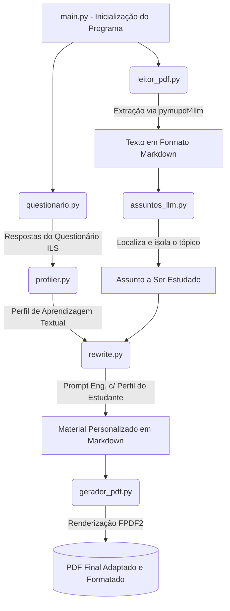

# Sistema de Personalização de Materiais Didáticos

Bem-vindo ao repositório do **Sistema de Personalização de Materiais Didáticos**. Este projeto visa adaptar automaticamente o conteúdo de disciplinas educacionais para alinhar-se com o perfil cognitivo de cada estudante, utilizando o modelo de estilo de aprendizagem de **Felder-Silverman** integrado com as capacidades das inteligências artificiais de linguagem profunda (**LLMs Google Gemini**).

Nesta versão mais recente, o sistema foi inteiramente otimizado: arquivos legados foram removidos e o fluxo principal foi consolidado, garantindo alta performance e um código limpo.

---

## 📂 Visão Geral da Arquitetura do Projeto

Abaixo estão todos os componentes centrais do projeto e como suas responsabilidades estão divididas:

- **`main.py`** 📍  
  O arquivo principal (orquestrador) do sistema. O processo se inicia aqui, integrando passo-a-passo todos os outros submódulos e arquivos.

- **`questionario.py`** 📝  
  Contém a lógica de aplicação do Questionário ILS (Index of Learning Styles) de Felder e Silverman. Ele exibe as perguntas, processa as respostas e mapeia as 4 dimensões do aluno (Compreensão, Percepção, Entrada e Processamento).

- **`profiler.py`** 🧠  
  Recebe os resultados brutos computados pelo questionário e utiliza inteligência artificial (Gemini) para transformar essas chaves em um perfil "humanizado" e textualmente descritivo de como aquele aluno, em especial, aprende melhor.

- **`leitor_pdf.py`** 📄  
  Utiliza a biblioteca *pymupdf4llm* para ler de forma eficiente apostilas ou materiais inteiros em formato `.pdf` (`disciplina.pdf`) e os converte com alta precisão e integridade para o formato textual `.md` (Markdown).

- **`assuntos_llm.py`** 🔍  
  Módulo avançado de localização textual com LLM. Ele escaneia a conversão em markdown do componente acima e isola tópicos ou trechos específicos que comporão a próxima lição adaptada que o aluno necessita estudar.

- **`rewrite.py`** ✍️  
  O núcleo de Inteligência Pedagógica. Recebe (1) o **trecho do assunto listado** e (2) a **persona descrita pelo `profiler.py`**, adaptando o tom, voz, analogias, níveis de abstração e linguagem daquele tópico exatamente para que ele soe como a forma ideal em que esse aluno consegue absorver conteúdo.

- **`gerador_pdf.py`** 🖨️  
  Motor de estilização final. Recebe o conteúdo que acabou de ser adaptado pelo *rewrite* em Markdown e o traduz novamente para um excelente e polido arquivo `.pdf` através da biblioteca FPDF2, guardando toda formatação estilizada em negrito, listas, layouts na página e evitando erros de margem ("Not enough horizontal space").

- **`gemini_config.py`** ⚙️  
  Interface de comunicação com os modelos de fundação do Google Gemini e configuração de credenciais via `.env`, gerenciando de forma unificada os parâmetros da API para todo o sistema.

---

## ⚙️ Como o Sistema Funciona?

O ciclo completo se propaga pelas seguintes etapas quando você roda `python main.py`:

1. **Entrevistando o Estudante:** A aplicação captura o modelo cognitivo e sensorial do aluno por meio de perguntas objetivas (Questionário ILS).
2. **Construindo a Persona Educacional:** O sistema computa o perfil exato dentre os 16 perfis possíveis de Felder-Silverman (Ex: *Ativo, Visual, Sensorial e Sequencial*).
3. **Extração de Conteúdo:** O sistema lê o material bruto da disciplina (`disciplina.pdf`) e o converte para Markdown.
4. **Isolamento de Tópicos:** A IA vasculha o texto e separa o assunto ideal ou o trecho que precisa ser estudado.
5. **A Adaptação Didática (Core):** O text selecionado é enviado em conjunto com o perfil do aluno para a LLM, que reescreve a teoria aplicando métodos condizentes (ex: mais gráficos para visuais, mais passos para sequenciais).
6. **PDF Final:** O texto personalizado é renderizado de volta em um arquivo de PDF limpo e agradável, pronto para o estudo do aluno.

---

## 🔄 Fluxograma de Funcionamento

O fluxograma a seguir demonstra a dinâmica modular das informações geradas até a entrega do PDF final:

