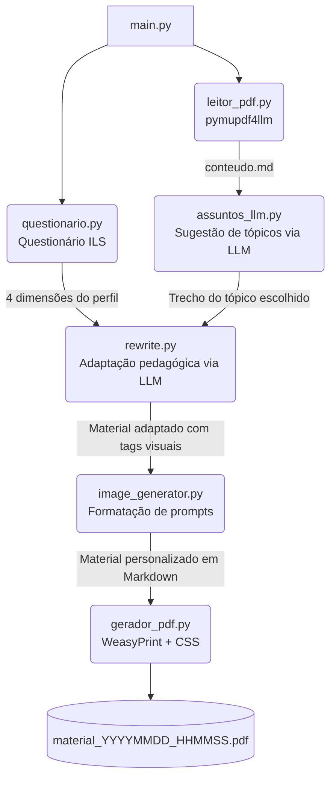

# Sistema de Personalização de Materiais Didáticos

Sistema acadêmico desenvolvido no âmbito do **Mestrado em Ciência da Computação — UFMA**, cujo objetivo é adaptar automaticamente materiais didáticos em PDF ao perfil cognitivo de cada estudante, com base no modelo de estilos de aprendizagem de **Felder-Silverman (ILS)** integrado à **API Gemini (Google AI)**.

---

## 📂 Arquitetura do Projeto

```text
projeto_bkb/
├── main.py                          # Orquestrador do pipeline completo
├── .env                             # Variáveis de ambiente (API keys) — não versionar
├── disciplina.pdf                   # Material base em PDF — fornecido pelo usuário
└── modulos/
    ├── aluno/
    │   └── questionario.py          # Questionário ILS e mapeamento de dimensões
    ├── llm/
    │   ├── gemini_config.py         # Configuração da SDK Gemini com retry automático
    │   ├── assuntos_llm.py          # Identifica e extrai o tópico escolhido via LLM
    │   └── rewrite.py               # Adapta o conteúdo ao perfil do aluno via LLM
    └── pdf/
        ├── leitor_pdf.py            # Converte PDF → Markdown (pymupdf4llm)
        └── gerador_pdf.py           # Renderiza Markdown → PDF (WeasyPrint + CSS GitHub)
```

---

## ⚙️ Como Funciona

Ao executar `python main.py`, o pipeline percorre 5 etapas em sequência:

### 1. Questionário de Perfil (`modulos/aluno/questionario.py`)
O aluno responde 4 perguntas do **Index of Learning Styles (ILS)**, que mapeiam as dimensões do modelo de Felder-Silverman:

| Dimensão | Opção A | Opção B |
|---|---|---|
| Compreensão | Sequencial | Global |
| Percepção | Sensorial | Intuitivo |
| Entrada | Visual | Verbal |
| Processamento | Ativo | Reflexivo |

### 2. Leitura do PDF (`modulos/pdf/leitor_pdf.py`)
O arquivo `disciplina.pdf` é processado via `pymupdf4llm`, convertendo todo o conteúdo textual para formato Markdown (`.md`). Imagens do PDF original não são embutidas — o foco é a fidelidade do texto para uso com LLMs.

### 3. Identificação do Tópico (`modulos/llm/assuntos_llm.py`)
Uma amostra do Markdown gerado é enviada ao Gemini, que sugere de 3 a 8 tópicos principais da disciplina. O aluno escolhe o tópico desejado (ou digita um tema livre). O sistema então extrai o trecho relevante do conteúdo usando as palavras-chave do tópico.

### 4. Adaptação Pedagógica (`modulos/llm/rewrite.py`)
O trecho do tópico e o perfil do aluno são enviados ao Gemini com um prompt estruturado segundo as diretrizes do ILS:
- **Sensorial/Intuitivo** → ênfase em exemplos práticos ou teoria conceitual
- **Visual/Verbal** → tags para representações visuais ou explicações narrativas detalhadas
- **Ativo/Reflexivo** → desafios práticos imediatos, ou perguntas instigantes para reflexão
- **Sequencial/Global** → trilha linear passo a passo, ou visão macro antes dos detalhes

### 5. Geração de Prompts Visuais (`modulos/llm/image_generator.py`)
Para alunos com perfil **Visual**, a IA gera blocos no formato `[SUGESTAO_IMAGEM: <prompt>]`. O módulo de imagens identifica essas ocorrências e formata um bloco de citação (Blockquote) Markdown. Esses prompts ficam visíveis no texto final para que o usuário possa gerar manualmente as imagens em ferramentas externas (como Midjourney ou DALL-E) com precisão.

### 6. Geração do PDF (`modulos/pdf/gerador_pdf.py`)
O material adaptado em Markdown é salvo na raiz e convertido para PDF via **WeasyPrint**, com tema visual inspirado no estilo do GitHub (tipografia limpa, tabelas, blocos de código e cabeçalho com o perfil do aluno).

---

## 🔄 Fluxograma



---

## 🚀 Como Executar

### Pré-requisitos

- Python 3.10+
- [Homebrew](https://brew.sh/) com Pango e Cairo instalados (necessário para WeasyPrint no macOS):

```bash
brew install pango cairo libffi
```

### Instalação

```bash
# Clone o repositório
git clone <url-do-repositorio>
cd projeto_bkb

# Crie e ative o ambiente virtual
python -m venv .venv
source .venv/bin/activate

# Instale as dependências
pip install pymupdf4llm google-generativeai python-dotenv markdown weasyprint
```

### Configuração

Crie um arquivo `.env` na raiz do projeto com sua chave da API Gemini:

```env
GEMINI_API_KEY=sua_chave_aqui
```

> Obtenha sua chave em: [https://aistudio.google.com/app/apikey](https://aistudio.google.com/app/apikey)

### Uso

1. Coloque o material da disciplina em PDF na raiz com o nome `disciplina.pdf`
2. Execute o programa:

```bash
python main.py
```

3. Siga as instruções no terminal: responda o questionário, escolha o tópico e aguarde a geração do PDF personalizado em `materiais_gerados/`.

---

## 📚 Referências

- Felder, R. M., & Silverman, L. K. (1988). *Learning and Teaching Styles in Engineering Education*.
- Troussas, C. et al. (2020). *Adaptive Learning Rate Based on Entropy*. Entropy, MDPI.
- Vaccaro, M. et al. (2025). *LLM-based Adaptive Content Generation*.
- [pymupdf4llm](https://github.com/pymupdf/RAG) — Extração de PDF otimizada para LLMs
- [WeasyPrint](https://weasyprint.org/) — Renderização HTML/CSS para PDF

---

## ⚠️ Observações e Envio ao GitHub

- O arquivo `.env` **não deve ser versionado**. Para evitar vazamento de chaves de API, certifique-se de ter um arquivo `.gitignore` no projeto. O projeto foi atualizado com um arquivo pronto.
- Os arquivos `.pdf` de origem e os conteúdos em `materiais_gerados/` e os arquivos temporários `.md` também são bloqueados pelo `.gitignore` para não lotar seu repositório.
- Apenas o código base (`main.py`, pasta `modulos/` e a documentação `README.md`/`EXPLICACAO.md`) deve subir no seu repositório do GitHub.
- O modelo Gemini é selecionado dinamicamente com base nos modelos disponíveis para a API key informada.
