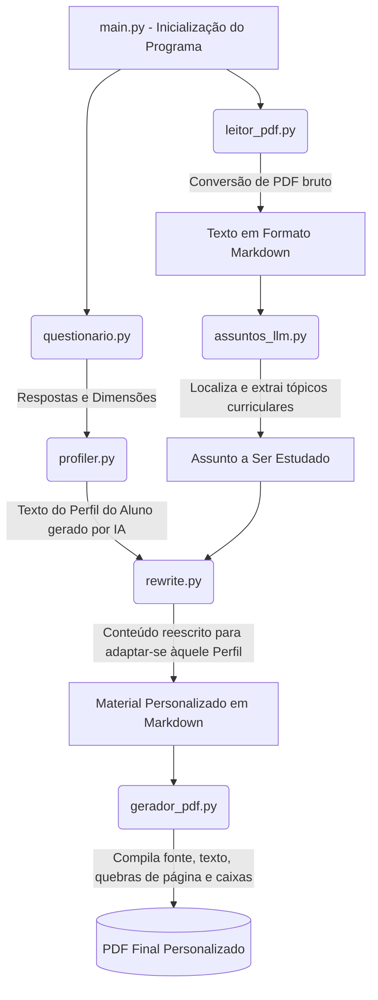

# Sistema de Personalização de Materiais Didáticos

Bem-vindo ao repositório do **Sistema de Personalização de Materiais Didáticos**. Este projeto visa adaptar automaticamente o conteúdo de disciplinas educacionais para alinhar-se com o perfil cognitivo de cada estudante, utilizando o modelo de estilo de aprendizagem de **Felder-Silverman** integrado com as capacidades das inteligências artificiais de linguagem profunda (**LLMs Google Gemini**).

---

## 📂 Visão Geral da Arquitetura

Aqui estão os componentes centrais do projeto e como são divididos em arquivos Python:

- **`main.py`** 📍  
  O arquivo principal (orquestrador) do sistema. O processo se inicia aqui, integrando passo-a-passo todos os outros submódulos e arquivos.

- **`questionario.py`** 📝  
  Contém a lógica de aplicação do Questionário ILS (Index of Learning Styles) de Felder e Silverman. Ele exibe as perguntas, processa as respostas e mapeia as 4 dimensões do aluno (Compreensão, Percepção, Entrada e Processamento).

- **`profiler.py`** 🧠  
  Recebe os resultados brutos computados pelo questionário e utiliza inteligência artificial (Gemini) para transformar essas chaves em um perfil "humanizado" e textualmente descritivo de como aquele aluno, em especial, aprende melhor.

- **`leitor_pdf.py`** 📄  
  Utiliza a biblioteca *pymupdf4llm* para ler de forma eficiente apostilas ou materiais inteiros em formato `.pdf` (`disciplina.pdf`) e os converte com alta precisão e integridade para o formato textual `.md` (Markdown).

- **`assuntos_llm.py`** 🔍  
  Módulo avançado de localização textual com LLM. Ele escaneia a conversão em markdown do componente acima e isola tópicos ou trechos específicos que comporão a próxima lição adaptada que o aluno necessita estudar.

- **`rewrite.py`** ✍️  
  O núcleo de Inteligência Pedagógica. Recebe (1) o **trecho do assunto listado** e (2) a **persona descrita pelo `profiler.py`**, adaptando o tom, voz, analogias, níveis de abstração e linguagem daquele tópico exatamente para que ele soe como a forma ideal em que esse aluno consegue absorver conteúdo.

- **`gerador_pdf.py`** 🖨️  
  Motor de estilização final. Recebe o conteúdo que acabou de ser adaptado pelo *rewrite* em Markdown e o traduz novamente para um excelente e polido arquivo `.pdf` através da biblioteca FPDF2, guardando toda formatação estilizada em negrito, listas, layouts na página, etc.

- **`gemini_config.py`** ⚙️  
  Interface de comunicação com os modelos de fundação do Google Gemini e configuração de credenciais via `.env`, tratamento de limites de requisições, instâncias e prompts do sistema.

---

## ⚙️ Como o Sistema Funciona?

O ciclo completo se propaga pelas seguintes etapas quando você roda `main.py`:

1. **Entrevistando o Estudante:** A aplicação captura o modelo cognitivo e sensorial do aluno por meio de perguntas.
2. **Construindo a Persona Educacional:** O sistema computa o perfil do aluno (Ex: *Ativo, Visual, Sensorial e Sequencial*).
3. **Traduzindo e Estruturando:** A Inteligência do sistema traduz todo o material da disciplina PDF original para Markdown, embutindo cabeçalhos e textos de modo que a I.A consiga ler.
4. **Extraindo Alvos (Chunks):** Uma I.A vasculha o arquivo da apostila para separar um tema escolhido.
5. **A Mágica da Adaptação Didática:** O sistema entrega a parte teórica da apostila na "mão" de um excelente Prompt LLM (atuando como professor acadêmico). A I.A reescreve a teoria na medida exata de como a Persona educacional aprende.
6. **Entrega Pronta:** O MD traduzido volta a virar um arquivo `PDF` bonito, formatado com o nome de perfil impresso e o texto final personalizado perfeitamente sem erros e guardado em disco local.

---

## 🔄 Fluxograma de Funcionamento

O fluxograma a seguir demonstra, de forma interligada, como os nossos módulos trocam informações até o PDF adaptado ser entregue:

