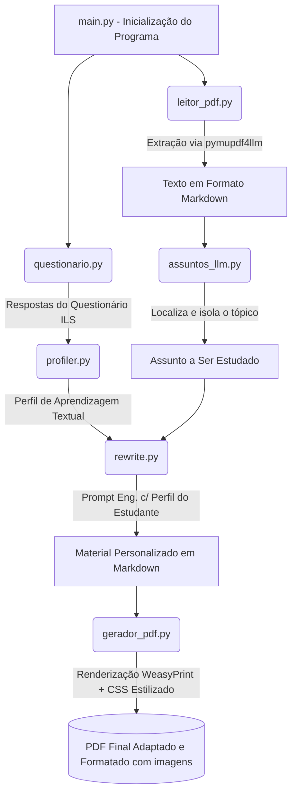

# Sistema de Personalização de Materiais Didáticos

Bem-vindo ao repositório do **Sistema de Personalização de Materiais Didáticos**. Este projeto visa adaptar automaticamente o conteúdo de disciplinas educacionais para alinhar-se com o perfil cognitivo de cada estudante, utilizando o modelo de estilo de aprendizagem de **Felder-Silverman** integrado com as capacidades das inteligências artificiais de linguagem profunda (**LLMs Google Gemini**).

Nesta versão mais recente, o sistema foi inteiramente otimizado: arquivos legados foram removidos e o fluxo principal foi consolidado, garantindo alta performance e um código limpo.

---

## 📂 Visão Estrutural e Arquitetura do Projeto

Abaixo está o mapeamento visual (árvore) de toda a arquitetura organizacional e de pastas do projeto, desenhados para que o ciclo escale mantendo a clareza e separação das responsabilidades de cada etapa do núcleo:

```text
projeto_root/
├── main.py (Orquestrador / Regente do ciclo de dados)
├── .env (Guarda senhas e sua API_KEY do serviço de IA)
├── disciplina.pdf (O livro base / material em PDF original)
└── modulos/
    ├── aluno/  (Modelagem Psicológico-Comportamental)
    │   ├── questionario.py (Aplica o teste ILS do perfil Felder-Silverman)
    │   └── profiler.py     (Constrói a "persona" descritiva do aluno via IA)
    ├── llm/    (Núcleo de Inteligência e Processamento)
    │   ├── gemini_config.py (Configurações base Google Gemini de acesso global)
    │   ├── assuntos_llm.py  (Poda o conteúdo total bruto e isola a proxima lição)
    │   └── rewrite.py       (A Inteligência Pedagógica: reescreve cirurgicamente o material)
    └── pdf/    (Motores de Extração IO e Layout)
        ├── leitor_pdf.py    (Scanner PyMuPDF de conversão livro > Markdown)
        └── gerador_pdf.py   (Renderiza o texto Markdown de volta em interface PDF rica)
```

---

## ⚙️ Como Funciona o Fluxo Principal e Passo a Passo?

A automação acontece via `main.py`. Ao iniciar o programa principal (`python main.py`), a comunicação viaja através das pastas em uma cadeia progressiva de tratamento de dados:

### 1. Entendendo Quem é o Aluno (`modulos/aluno/questionario.py`)
Tudo começa mapeando o estudante cognitivamente. O aplicativo lança perguntas pontuais do clássico questionário de percepção humana. Através de algoritmos se mapeia e ranqueia as **4 dimensões base** (Se este cérebro é Visual ou Verbal, Ativo ou Reflexivo, Sensorial ou Intuitivo, Sequencial ou Global).

### 2. Criando a Identidade Educacional (`modulos/aluno/profiler.py`)
Com apenas gabaritos "A" ou "B" crus em mãos as enviamos para a IA interpretar. Por design, transformamos pontuações num **perfil em texto realístico de ensinamento**: *"Esse aluno necessita de passos metódicos, detesta textos muito densos e aprende melhor enxergando relações em lista..."*.

### 3. Extraindo a Matéria Bruta (`modulos/pdf/leitor_pdf.py`)
Pausa e foco apenas no arquivo. Com uma tecnologia altamente avançada e com acurácia nativa voltada à LLMs, processamentos do laboratório de Artifex `pymupdf4llm` pegam todo o pesado material e esmiúçam extraindo páginas, resgates ricos, imagens embutidas nativamente em base64 e tabelas completas tudo para a linguagem limpa (*.md Markdown*).

### 4. Recrutando a Próxima Lição (`modulos/llm/assuntos_llm.py`)
Evitando colapso de memória via saturação e lentidão do servidor enviando livros monumentais, a rotina esmiúça o arquivo Markdown (gerado na extração acima) e garimpa/recorta a fatia cirúrgica e minuciosa que deverá fazer parte exclusiva do currículo estudado agora, exilando todo o resto irrelevante.

### 5. O Motor da Mágica — Adaptação Fina (`modulos/llm/rewrite.py`)
**Este é o núcleo pedagógico real!** O script pega a lição recortada e o diagnóstico comportamental do aluno e solicita à LLM que reinvente o formato do capítulo do zero, alinhando as metodologias explicativas ao raciocínio lógico daquele cérebro. Aqui o conteúdo adquire nova voz, cria exemplos práticos diferenciados e, caso o aluno possua um perfil visual aguçado, a IA é instruída a reutilizar diretamente as imagens e ilustrações da apostila original contextualizando-as à sua explicação teórica, evitando gastar processamento externo ou inventar imagens do zero.

### 6. Emissão do Compilado Curricular Didático (`modulos/pdf/gerador_pdf.py`)
A obra de ensino reencarnada em formatação de blocos e tags (*Markdown*) retorna ao Python sendo salva primeiro nas pastas de `materiais_gerados/` para segurança e portabilidade. Após manter de forma pura as imagens nativas originais (Base64) injetadas no texto de estudo, a engrenagem repassa o compilado integral para o motor **WeasyPrint**, que usa sua engine HTML rica revestida pelo tema oficial refinado do **GitHub CSS** criando tabelas suaves, paginações exatas e uma beleza visual inigualável em formato PDF com compatibilidade silenciada fluída para o macOS.

---

## 🔄 Fluxograma de Funcionamento

O fluxograma a seguir demonstra a dinâmica modular das informações geradas até a entrega do PDF final:


