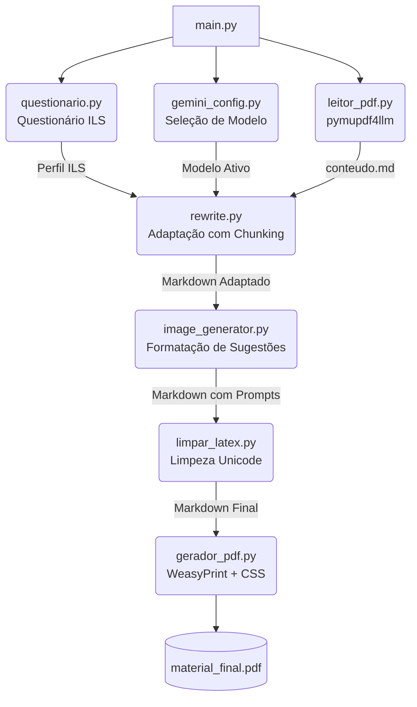

# Sistema de Personalização de Materiais Didáticos

Sistema acadêmico desenvolvido no âmbito do **Mestrado em Ciência da Computação — UFMA**, cujo objetivo é adaptar automaticamente materiais didáticos em PDF ao perfil cognitivo de cada estudante, com base no modelo de estilos de aprendizagem de **Felder-Silverman (ILS)** integrado à **API Gemini (Google AI)**.

---

## 📂 Arquitetura do Projeto

```text
projeto_bkb/
├── main.py                          # Orquestrador do pipeline completo
├── .env                             # Variáveis de ambiente (API keys) — não versionar
├── disciplina.pdf                   # Material base em PDF — fornecido pelo usuário
├── limpar_latex.py                  # Pós-processamento de segurança (LaTeX -> Unicode)
└── modulos/
    ├── aluno/
    │   └── questionario.py          # Questionário ILS e mapeamento de dimensões
    ├── llm/
    │   ├── gemini_config.py         # Configuração com Fallback e Seleção Manual de Modelos
    │   ├── rewrite.py               # Adapta o conteúdo ao perfil do aluno via LLM (com Chunking)
    │   └── image_generator.py       # Formata sugestões de imagens para o perfil Visual
    └── pdf/
        ├── leitor_pdf.py            # Converte PDF → Markdown (pymupdf4llm)
        └── gerador_pdf.py           # Renderiza Markdown → PDF (WeasyPrint + CSS GitHub)
```

---

## ⚙️ Como Funciona

Ao executar `python main.py`, o pipeline percorre as seguintes etapas:

### 1. Seleção de Modelo e Questionário (`modulos/llm/gemini_config.py` e `aluno/questionario.py`)
O sistema inicia permitindo a escolha manual do modelo Gemini disponível na sua conta (com fallback automático). Em seguida, o aluno responde ao questionário **ILS**, que mapeia as dimensões de Felder-Silverman:

| Dimensão | Opção A | Opção B |
|---|---|---|
| Compreensão | Sequencial | Global |
| Percepção | Sensorial | Intuitivo |
| Entrada | Visual | Verbal |
| Processamento | Ativo | Reflexivo |

### 2. Conversão PDF para Markdown (`modulos/pdf/leitor_pdf.py`)
O arquivo `disciplina.pdf` é processado via `pymupdf4llm`. O conteúdo é extraído de forma estruturada para Markdown, garantindo que tabelas e hierarquias sejam preservadas para melhor compreensão da IA.

### 3. Adaptação Pedagógica com Chunking (`modulos/llm/rewrite.py`)
Diferente de abordagens simples, o sistema utiliza **Chunking de 8.000 caracteres**. O material integral é processado em blocos, onde cada bloco recebe o **Sumário Global** como contexto para evitar perda de coesão. A IA adapta o **tom, exemplos e estrutura** conforme o perfil ILS — mas nunca a substância do conteúdo original (ver [Regras de Fidelidade e Validação](#-regras-de-fidelidade-e-validação) abaixo).

### 4. Geração de Sugestões Visuais (`modulos/llm/image_generator.py`)
Para perfis **Visuais**, a IA insere tags `[SUGESTAO_IMAGEM]`. Este módulo identifica essas tags e as transforma em blocos de citação formatados com prompts detalhados para geração manual em IAs geradoras de imagem.

### 5. Limpeza de LaTeX (`limpar_latex.py`)
Um passo de segurança que varre o material adaptado em busca de sintaxe LaTeX residual (como `$...$`), convertendo-a para caracteres **Unicode** (como ¬, ∧, ∨, →). Isso garante que o PDF final seja legível em qualquer leitor sem necessidade de bibliotecas matemáticas complexas.

### 6. Geração do PDF Final (`modulos/pdf/gerador_pdf.py`)
O material é renderizado via **WeasyPrint** usando um tema CSS inspirado no GitHub, produzindo um documento profissional com cabeçalho personalizado e tipografia otimizada.

---

## 🛡️ Regras de Fidelidade e Validação

Ao testar o pipeline com material real, identificamos e corrigimos três classes de problema que podem surgir na resposta do modelo de IA. As regras abaixo estão implementadas no prompt de sistema e na validação automática de `modulos/llm/rewrite.py`:

- **Fidelidade ao conteúdo original:** a IA adapta apenas a forma (tom, exemplos de apoio, estrutura) — nunca corrige, questiona ou substitui dados/exemplos/afirmações do material do professor, mesmo que perceba uma possível inconsistência. Isso preserva a rastreabilidade: um erro no PDF final deve ser atribuível à fonte, não a uma "correção" silenciosa da IA.
- **Proibição de vazamento de raciocínio interno:** a resposta final deve conter apenas o texto já polido, nunca rascunhos, dúvidas ou autocorreções expostas (ex.: "Self-correction", "Wait,", "Okay, so") nem mistura de inglês em meio ao texto em português. Uma validação automática (`detectar_vazamento_raciocinio`) varre cada bloco gerado e regenera automaticamente qualquer bloco que contenha esses marcadores.
- **Restrição de escopo das Leis de Equivalência:** ao justificar simplificações lógicas, a IA só pode citar leis explicitamente presentes no material do professor — nunca leis externas ao curso.

Detalhes de quando e por que cada regra foi criada estão no [CHANGELOG.md](CHANGELOG.md).

---

## 🔄 Fluxograma


```mermaid
graph TD
    A[main.py] --> B(questionario.py\nQuestionário ILS)
    B -->|Perfil ILS| H

    A --> C(gemini_config.py\nSeleção de Modelo)
    C -->|Modelo Ativo| H

    A --> D(leitor_pdf.py\npymupdf4llm)
    D -->|conteudo.md| H

    H(rewrite.py\nAdaptação com Chunking)
    H -->|Markdown Adaptado| I
    
    I(image_generator.py\nFormatação de Sugestões)
    I -->|Markdown com Prompts| L

    L(limpar_latex.py\nLimpeza Unicode)
    L -->|Markdown Final| J

    J(gerador_pdf.py\nWeasyPrint + CSS)
    J --> K[(material_final.pdf)]
```

---

## 🚀 Como Executar

### Pré-requisitos

- Python 3.10+
- [Homebrew](https://brew.sh/) com Pango e Cairo instalados (necessário para WeasyPrint no macOS):

```bash
brew install pango cairo libffi
```

### Instalação

```bash
# Clone o repositório
git clone <url-do-repositorio>
cd projeto_bkb

# Crie e ative o ambiente virtual
python -m venv .venv
source .venv/bin/activate

# Instale as dependências
pip install pymupdf4llm google-generativeai python-dotenv markdown weasyprint
```

### Configuração

Crie um arquivo `.env` na raiz do projeto com sua chave da API Gemini:

```env
GEMINI_API_KEY=sua_chave_aqui
```

> Obtenha sua chave em: [https://aistudio.google.com/app/apikey](https://aistudio.google.com/app/apikey)

### Uso

1. Coloque o material da disciplina em PDF na raiz com o nome `disciplina.pdf`
2. Execute o programa:

```bash
python main.py
```

3. Siga as instruções no terminal: responda o questionário, escolha o tópico e aguarde a geração do PDF personalizado em `materiais_gerados/`.

---

## 📚 Referências

- Felder, R. M., & Silverman, L. K. (1988). *Learning and Teaching Styles in Engineering Education*.
- Troussas, C. et al. (2020). *Adaptive Learning Rate Based on Entropy*. Entropy, MDPI.
- Vaccaro, M. et al. (2025). *LLM-based Adaptive Content Generation*.
- [pymupdf4llm](https://github.com/pymupdf/RAG) — Extração de PDF otimizada para LLMs
- [WeasyPrint](https://weasyprint.org/) — Renderização HTML/CSS para PDF

---

## ⚠️ Observações e Envio ao GitHub

- O arquivo `.env` **não deve ser versionado**. Para evitar vazamento de chaves de API, certifique-se de ter um arquivo `.gitignore` no projeto. O projeto foi atualizado com um arquivo pronto.
- Os arquivos `.pdf` de origem e os conteúdos em `materiais_gerados/` e os arquivos temporários `.md` também são bloqueados pelo `.gitignore` para não lotar seu repositório.
- Apenas o código base (`main.py`, pasta `modulos/` e a documentação `README.md`/`EXPLICACAO.md`) deve subir no seu repositório do GitHub.
- O modelo Gemini é selecionado dinamicamente com base nos modelos disponíveis para a API key informada.
- Existe um módulo legado `modulos/llm/assuntos_llm.py` (escolha de assunto pelo aluno) reservado para uma segunda versão do projeto — hoje o pipeline adapta o material integral da disciplina, sem essa escolha.
- Para o histórico de correções de bugs e decisões de design, consulte o [CHANGELOG.md](CHANGELOG.md).
